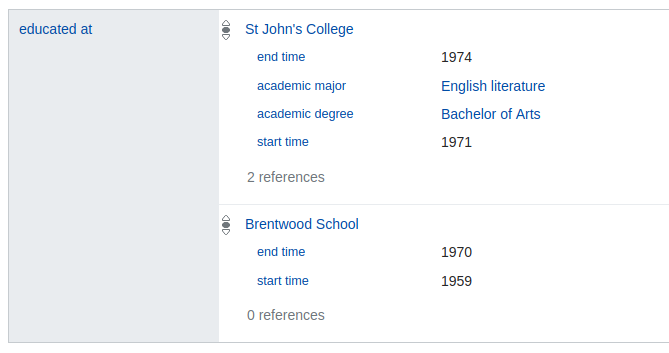

Entities
========

:py:mod:`qwikidata.entity`

Description
-----------

The majority of code in this package is dedicated to classes that can be used to
represent Wikidata entities.  We consider three types of entities,

* :py:class:`qwikidata.entity.WikidataItem`
* :py:class:`qwikidata.entity.WikidataProperty`
* :py:class:`qwikidata.entity.WikidataLexeme`

Examples
--------

In order to use the wikidata entity classes we will need some data.
Wikidata makes full dumps of the knowledge base available in JSON
format, but we will use their linked data API instead to grab data for
just one entity.  If you'd like to see the documentation for qwikidata
objects that handle either of these things, you can follow the links below,

  * :py:class:`qwikidata.json_dump.WikidataJsonDump`
  * :py:func:`qwikidata.linked_data_interface.get_entity_dict_from_api`

.. note::

   Currently the JSON dumps provided by Wikidata do not include Lexemes but they are available
   through the linked data interface.  See https://phabricator.wikimedia.org/T195419

Creation
~~~~~~~~

For now, lets just get the raw data dictionary for "Douglas Adams" (aka
`Q42 <https://www.wikidata.org/wiki/Q42>`_) and create an instance of
:py:class:`qwikidata.entity.WikidataItem`.

.. code-block:: python

  >>> from qwikidata.linked_data_interface import get_entity_dict_from_api
  >>> from qwikidata.entity import WikidataItem, WikidataProperty

  >>> q42_dict = get_entity_dict_from_api("Q42")
  >>> q42 = WikidataItem(q42_dict)

Basic Data
~~~~~~~~~~

Instances of this class make basic information about Douglas Adams
available via attributes and methods.

.. code-block:: python

  >>> q42.entity_id
  'Q42'

  >>> q42.entity_type
  'item'

  >>> q42.get_label()
  'Douglas Adams'

  >>> q42.get_description()
  'author and humorist'

  >>> q42.get_aliases()
  ['Douglas Noël Adams', 'Douglas Noel Adams', 'Douglas N. Adams']

  >>> q42.get_enwiki_title()
  'Douglas Adams'

  >>> q42.get_sitelinks()["enwiki"]["url"]
  'https://en.wikipedia.org/wiki/Douglas_Adams'

.. note::

  The ``entity_id`` and ``entity_type`` values are singular and come from the top level of the entity
  dictionary (``q42_dict``) so they are attached to the instance as attributes during initialization.
  The other data (label, description, ...) is non-singular (has values for many languages)
  and non-trivial to parse from the entity dictionary.  Therefore, we supply this data via methods
  so that the entity dictionary is only parsed "on demand".  This saves a lot of time when
  iterating over a large number of entities.

In addition, the ``__str__`` and ``__repr__`` methods return a summary of this
basic info,

.. code-block:: python

  >>> print(q42)
  WikidataItem(label=Douglas Adams, id=Q42, description=author and humorist, aliases=['Douglas Noël Adams', 'Douglas Noel Adams', 'Douglas N. Adams'], enwiki_title=Douglas Adams)

By default, these methods return strings in English.  Analogous information is
available in many different languages by passing the ``lang`` keyword.  For example,
the Dutch version of the description of Douglas Adams is,

.. code-block:: python

  >>> q42.get_description(lang="nl")
  'Engelse schrijver (1952-2001)'

A `list of all the language codes`_ is available from Wikidata.

Claims / Statements
~~~~~~~~~~~~~~~~~~~

So far we've covered the basic metadata available for an entity (labels,
descriptions, aliases, ...).  However, the real power of wikidata
lies in what are called "claims" or "statements".

  "In Wikidata, a concept, topic, or object is represented by an item.
  Each item is accorded its own page. A statement is how the information
  we know about an item—the data we have about it—gets recorded in Wikidata."

  -- https://www.wikidata.org/wiki/Help:Statements

Lets examine the claims about Douglas Adams with property `P69`_ ("educated at").
Here's what they look like on the Wikidata page,

   The P69 ("eduated at") claim group for Q42 ("Douglas Adams") as displayed on the
   Wikidata webstite (Aug. 2018).

We can see that there are two claims here, one for "St John's College" (`Q691283`_) and one for
"Brentwood School" (`Q4961791`_).  The "St John's College" entry has four qualifiers and two references
while the "Brentwood School" entry has two qualifiers and zero references.

We can access this data from our Douglas Adams object (`q42`) using the `get_claims` method
which returns a dictionary mapping property id to
:py:class:`qwikidata.claim.WikidataClaimGroup`.

.. code-block:: python

  >>> claim_groups = q42.get_truthy_claim_groups()
  >>> p69_claim_group = claim_groups["P69"]
  >>> len(p69_claim_group)
  2

.. note::

    The methods that return claim groups come in "truthy" and "standard" versions,

    * :py:func:`qwikidata.entity.ClaimsMixin.get_claim_group`
    * :py:func:`qwikidata.entity.ClaimsMixin.get_truthy_claim_group`

    * :py:func:`qwikidata.entity.ClaimsMixin.get_claim_groups`
    * :py:func:`qwikidata.entity.ClaimsMixin.get_truthy_claim_groups`

    You almost always want to use the truthy versions.
    Truthy is defined in the Wikidata RDF dump format docs,

     "Truthy statements represent statements that have the best non-deprecated rank for a
     given property. Namely, if there is a preferred statement for a property P, then only
     preferred statements for P will be considered truthy. Otherwise, all normal-rank
     statements for P are considered truthy."

     -- `RDF dump format docs on truthy statements`_

Each claim in the claim group has a ``main_snak`` attribute that represents the primary information
of the claim, as well as `qualifiers` and `references` attributes.  In this case, the main snak
of one claim would reference "St John's College" and the other "Brentwood School".
Snaks are a central data structure in Wikidata.  They appear in each claim in the following way,

  * **main_snak**: An instance of :py:class:`qwikidata.snak.WikidataSnak`
  * **qualifiers** (`OrderedDict`): property id -> list of :py:class:`qwikidata.claim.WikidataQualifier`
  * **references** (`list`): Each element is an instance of :py:class:`qwikidata.claim.WikidataReference`

Each snak has one datavalue
(defined in :py:mod:`qwikidata.datavalue`).
The datavalues store the raw data that we are interested in.  There are seven basic
data types for datavalues and we use classes to represent them,

  * :py:class:`qwikidata.datavalue.GlobeCoordinate`
  * :py:class:`qwikidata.datavalue.MonolingualText`
  * :py:class:`qwikidata.datavalue.Quantity`
  * :py:class:`qwikidata.datavalue.String`
  * :py:class:`qwikidata.datavalue.Time`
  * :py:class:`qwikidata.datavalue.WikibaseEntityId`
  * :py:class:`qwikidata.datavalue.WikibaseUnmappedEntityId`

Now, lets examine the first claim and grab some data.

.. code-block:: python

  >>> claim = p69_claim_group[0]
  >>> print(f"claim.rank={claim.rank}")
  claim.rank=normal

  >>> qid = claim.mainsnak.datavalue.value["id"]
  >>> print(qid)
  Q691283

  >>> entity = WikidataItem(get_entity_dict_from_api(qid))
  >>> print(entity.get_label())
  St John's College

  >>> for pid, quals in claim.qualifiers.items():
  >>>     prop = WikidataProperty(get_entity_dict_from_api(pid))
  >>>     for qual in quals:
  >>>         if qual.snak.snaktype != "value":
  >>>             continue
  >>>         else:
  >>>             print(f"{prop.get_label()}: {qual.snak.datavalue}")
  end time: Time(time=+1974-01-01T00:00:00Z, precision=9)
  academic major: WikibaseEntityid(id=Q186579)
  academic degree: WikibaseEntityid(id=Q1765120)
  start time: Time(time=+1971-00-00T00:00:00Z, precision=9)

  >>> for ref_num, ref in enumerate(claim.references):
  >>>     print(f"ref num={ref_num}")
  >>>     for pid, snaks in ref.snaks.items():
  >>>         prop = WikidataProperty(get_entity_dict_from_api(pid))
  >>>         for snak in snaks:
  >>>             if snak.snaktype != "value":
  >>>                 continue
  >>>             else:
  >>>                 print(f"{prop.get_label()}: {snak.datavalue}")
  ref num=0
  stated in: WikibaseEntityid(id=Q5375741)
  ref num=1
  reference URL: String(value=http://www.nndb.com/people/731/000023662/)
  language of work or name: WikibaseEntityid(id=Q1860)
  publisher: WikibaseEntityid(id=Q1373513)
  retrieved: Time(time=+2013-12-07T00:00:00Z, precision=11)
  title: MongolingualText(text=Douglas Adams, language=en)

.. note::

    There are a few things to note about the code and output above.

    * We print the ``rank`` attribute of the claim.  Claims can have three ranks,
      "preferred", "normal", or "deprecated".  You shouldn't have to worry about
      this is you use "truthy" claims.

    * We check the ``snaktype`` and continue to the next iteration if it is not equal
      to "value".  Snaktypes can be "value", "somevalue", or "novalue".  These
      indicate a known value, an unknown value, and no existing value respectively.

    * We have relied on the ``__str__`` implementations of each datavalue class to present
      a short string summarizing the information.

    * The linked data interface API (i.e. :py:func:`qwikidata.linked_data_interface.get_entity_dict_from_api`)
      is fine for exploring and prototyping, but for large scale calculations its best
      to use the JSON dump.

This was just an introduction to get you started.  There is lots more to explore.
Enjoy!

.. _list of all the language codes: https://www.wikidata.org/wiki/Help:Wikimedia_language_codes/lists/all
.. _P31: https://www.wikidata.org/wiki/Property:P31
.. _P69: https://www.wikidata.org/wiki/Property:P69
.. _Q691283: https://www.wikidata.org/wiki/Q691283
.. _Q4961791: https://www.wikidata.org/wiki/Q4961791
.. _RDF dump format docs on truthy statements: https://www.mediawiki.org/wiki/Wikibase/Indexing/RDF_Dump_Format#Truthy_statements
